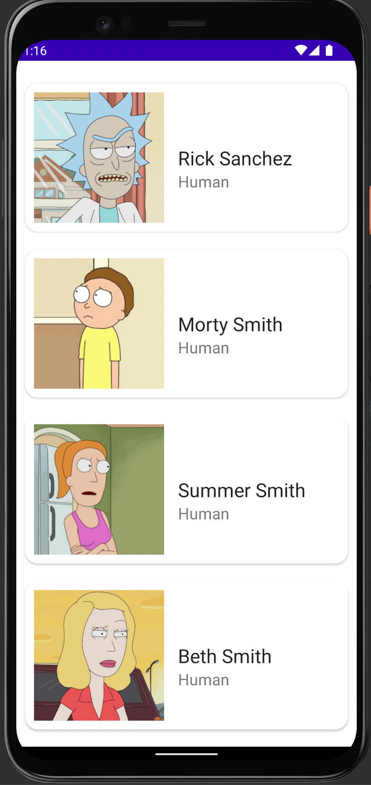

# Ricky
A Simple Android Mobile Application to showcase use of paging 3 library and MVVM architecture.

## Tech Stack

- MVVM Pattern
- Kotlin
- Coroutines, Flow 
- Dagger Hilt
- Retrofit2
- Dagger Hilt
- Glide

## Screenshot

